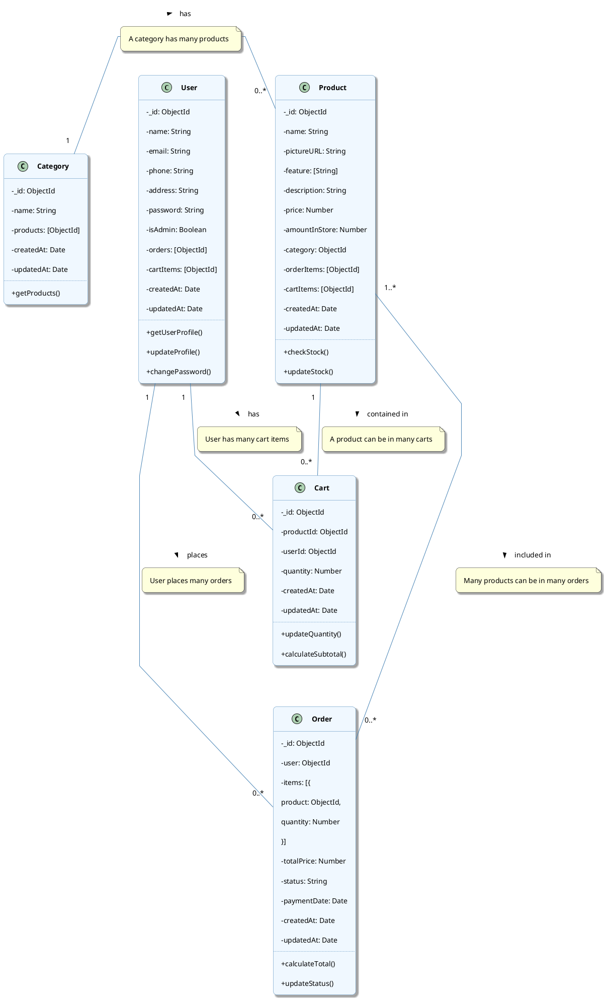

# E-Commerce System Class Diagram

This document contains a PlantUML class diagram focusing on the data models of the e-commerce system and their relationships.

## Models Class Diagram

## Detailed Model Descriptions

### User Model
- Represents a user in the system
- Contains personal information (name, email, phone, address)
- Stores authentication information (password, admin rights)
- References to orders and cart items
- Methods:
  - `getUserProfile()`: Retrieves user profile information
  - `updateProfile()`: Updates personal information
  - `changePassword()`: Changes user password

### Product Model
- Represents a purchasable product
- Contains product details (name, image, features, description, price)
- Tracks inventory with amountInStore
- Belongs to a category
- References to orders and carts containing this product
- Methods:
  - `checkStock()`: Checks available inventory
  - `updateStock()`: Updates inventory quantity

### Category Model
- Represents a product category
- Contains a category name
- References to products in this category
- Methods:
  - `getProducts()`: Gets list of products in the category

### Cart Model
- Represents an item in a user's shopping cart
- Links a user to a product with a specific quantity
- Used for temporary storage before creating an order
- Methods:
  - `updateQuantity()`: Updates product quantity
  - `calculateSubtotal()`: Calculates total value of the cart item

### Order Model
- Represents a completed purchase
- Contains a reference to the user who placed the order
- Contains a list of items (products and quantities)
- Tracks the total price
- Tracks the order status (pending, processing, shipped, delivered, completed)
- Records payment date
- Methods:
  - `calculateTotal()`: Calculates total order value
  - `updateStatus()`: Updates order status

## Model Relationships

1. **User to Order**: One-to-Many. A user can place multiple orders, but each order belongs to exactly one user.

2. **User to Cart**: One-to-Many. A user can have multiple items in their cart, but each cart item belongs to exactly one user.

3. **Product to Cart**: One-to-Many. A product can be in multiple users' carts, but each cart item refers to exactly one product.

4. **Category to Product**: One-to-Many. A category can contain multiple products, but each product belongs to exactly one category.

5. **Product to Order**: Many-to-Many. A product can be included in multiple orders, and an order can contain multiple products. This relationship is implemented through the items array in the Order model.

## How to Use This Class Diagram

1. Copy the PlantUML code
2. Paste it into a PlantUML editor or renderer
3. Generate the diagram

You can use online PlantUML editors like:
- [PlantUML Online Server](https://www.plantuml.com/plantuml/uml/)
- [PlantText](https://www.planttext.com/)

Or use extensions in your IDE:
- VS Code: PlantUML extension
- JetBrains IDEs: PlantUML integration plugin

## Benefits of the Class Diagram

1. **Data Structure Visualization**: Helps understand the objects in the system and relationships between them
2. **Design Documentation**: Provides clear documentation of data structures for the development team
3. **Development Support**: Serves as a foundation for code implementation
4. **Easy Expansion**: Helps identify ways to extend the system in the future
5. **Effective Communication**: Facilitates effective communication between team members
