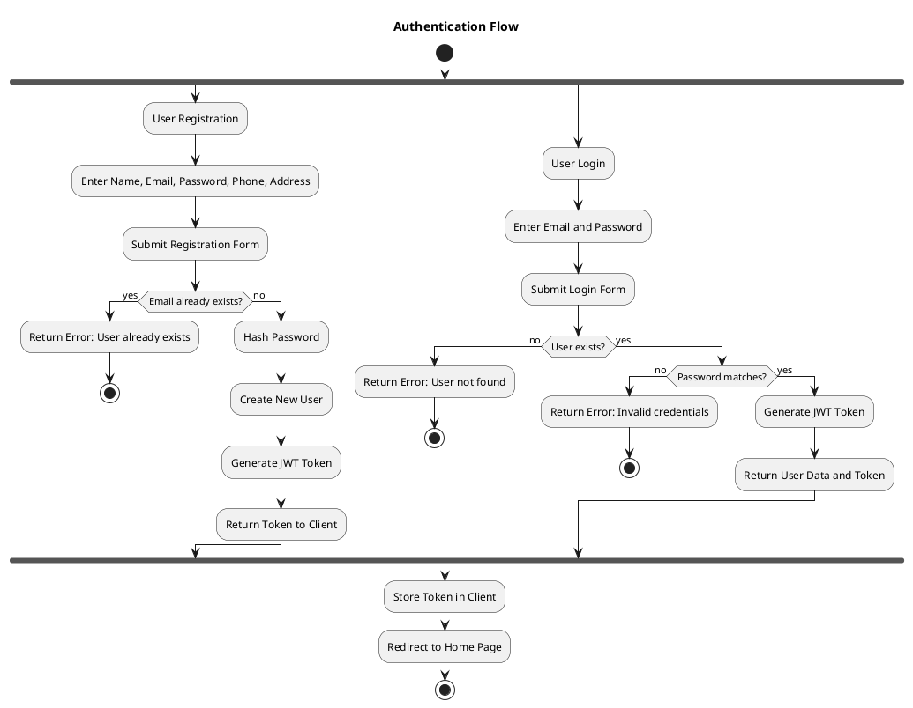
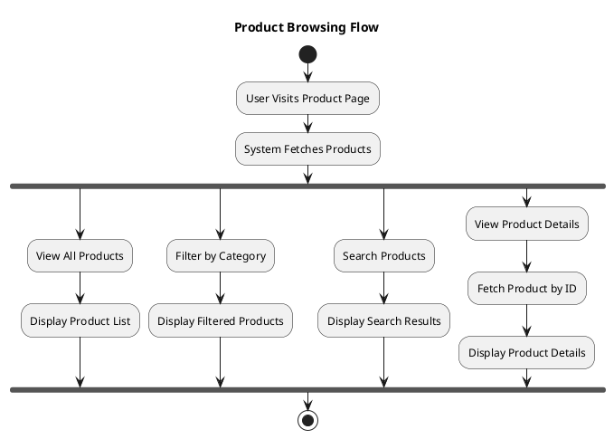
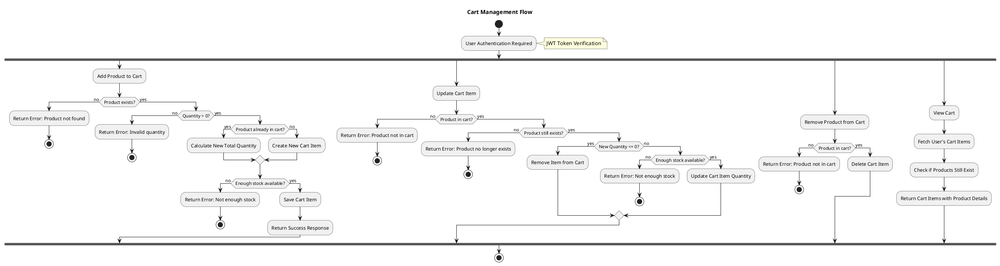
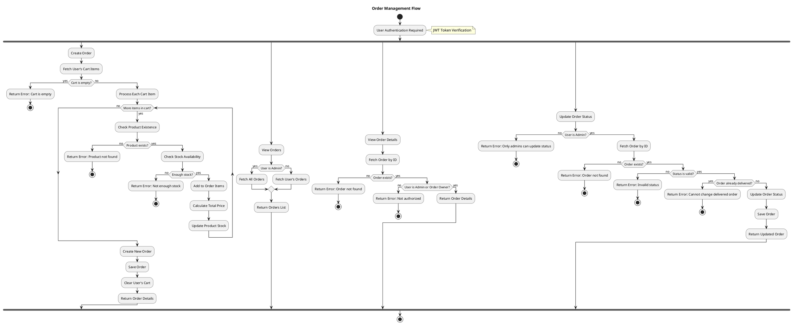
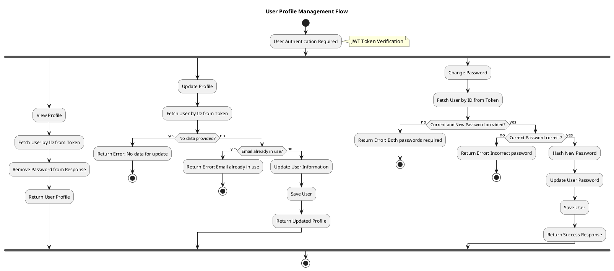
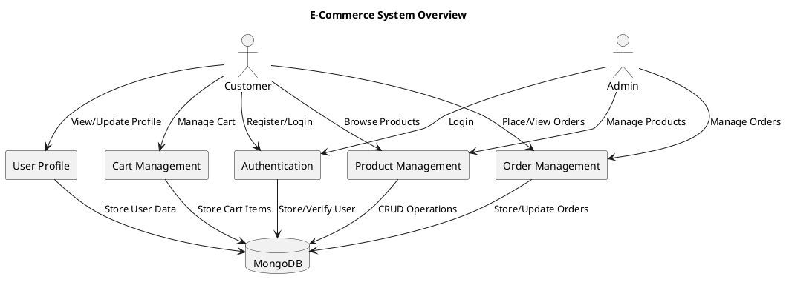
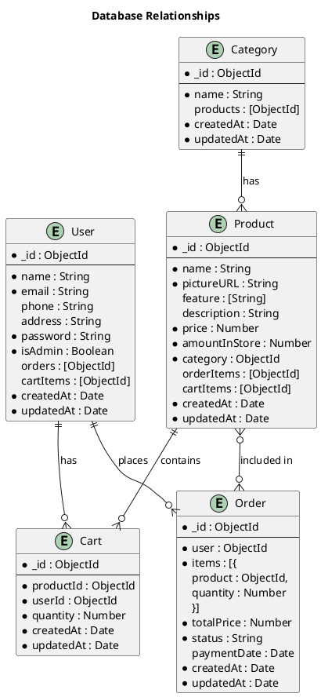

# E-Commerce System Activity Diagrams

This document contains PlantUML activity diagrams for the main flows in the e-commerce system.

## Authentication Flow

## Product Browsing Flow

## Cart Management Flow

## Order Management Flow

## User Profile Management Flow

## System Overview Diagram

## Database Relationship Diagram

## How to Use These Diagrams

1. Copy the PlantUML code for the diagram you want to visualize
2. Paste it into a PlantUML editor or renderer
3. Generate the diagram

You can use online PlantUML editors like:
- [PlantUML Online Server](https://www.plantuml.com/plantuml/uml/)
- [PlantText](https://www.planttext.com/)

Or use extensions in your IDE:
- VS Code: PlantUML extension
- JetBrains IDEs: PlantUML integration plugin

## Notes on the System Architecture

The system follows a typical MVC (Model-View-Controller) architecture with:

1. **Models**: MongoDB schemas for User, Product, Category, Cart, and Order
2. **Controllers**: Handle HTTP requests and responses
3. **Services**: Contain business logic and database operations
4. **Routes**: Define API endpoints and connect them to controllers
5. **Middleware**: Handle authentication and other cross-cutting concerns

The system uses JWT for authentication and authorization, with different access levels for regular users and administrators.
