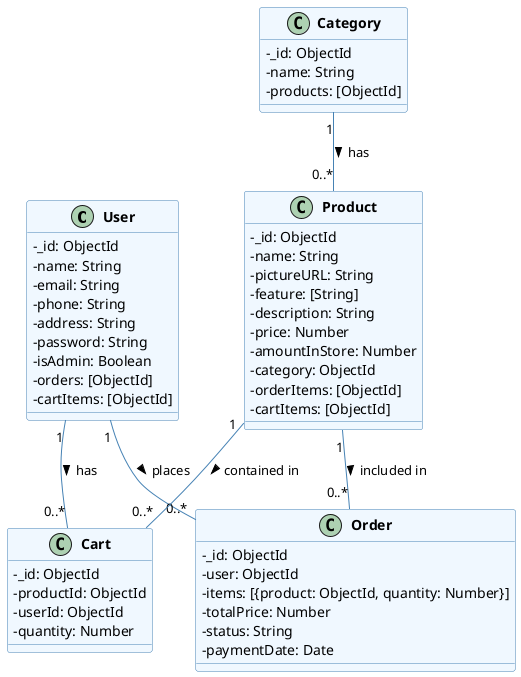
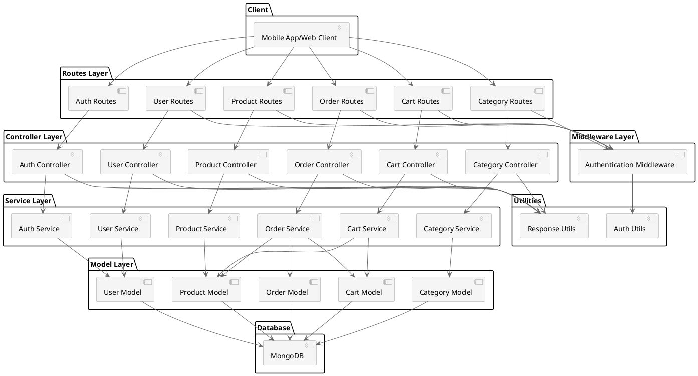

# E-Commerce System Class Diagram

This document contains PlantUML class diagrams for the e-commerce system, showing the relationships between models, controllers, services, and other components.

## Main Class Diagram

```plantuml
@startuml E-Commerce System Class Diagram
skinparam classAttributeIconSize 0
skinparam classFontStyle bold
skinparam classBackgroundColor #f5f5f5
skinparam classBorderColor #999999
skinparam arrowColor #666666

package "Models" {
  class User {
    - _id: ObjectId
    - name: String
    - email: String
    - phone: String
    - address: String
    - password: String
    - isAdmin: Boolean
    - orders: [ObjectId]
    - cartItems: [ObjectId]
    - createdAt: Date
    - updatedAt: Date
  }

  class Product {
    - _id: ObjectId
    - name: String
    - pictureURL: String
    - feature: [String]
    - description: String
    - price: Number
    - amountInStore: Number
    - category: ObjectId
    - orderItems: [ObjectId]
    - cartItems: [ObjectId]
    - createdAt: Date
    - updatedAt: Date
  }

  class Category {
    - _id: ObjectId
    - name: String
    - products: [ObjectId]
    - createdAt: Date
    - updatedAt: Date
  }

  class Cart {
    - _id: ObjectId
    - productId: ObjectId
    - userId: ObjectId
    - quantity: Number
    - createdAt: Date
    - updatedAt: Date
  }

  class Order {
    - _id: ObjectId
    - user: ObjectId
    - items: [{product: ObjectId, quantity: Number}]
    - totalPrice: Number
    - status: String
    - paymentDate: Date
    - createdAt: Date
    - updatedAt: Date
  }
}

package "Controllers" {
  class AuthController {
    + register(req, res): Promise<Response>
    + login(req, res): Promise<Response>
  }

  class UserController {
    + getByEmail(req, res): Promise<Response>
    + create(req, res): Promise<Response>
    + getProfile(req, res): Promise<Response>
    + updateProfile(req, res): Promise<Response>
    + changePassword(req, res): Promise<Response>
  }

  class ProductController {
    + get(req, res): Promise<Response>
    + getById(req, res): Promise<Response>
    + createProduct(req, res): Promise<Response>
    + updateProduct(req, res): Promise<Response>
    + deleteProduct(req, res): Promise<Response>
  }

  class CategoryController {
    + create(req, res): Promise<Response>
    + get(req, res): Promise<Response>
    + update(req, res): Promise<Response>
    + delete(req, res): Promise<Response>
  }

  class CartController {
    + add(req, res): Promise<Response>
    + remove(req, res): Promise<Response>
    + update(req, res): Promise<Response>
    + getByUserId(req, res): Promise<Response>
  }

  class OrderController {
    + getOrders(req, res): Promise<Response>
    + getOrderById(req, res): Promise<Response>
    + create(req, res): Promise<Response>
    + updateStatus(req, res): Promise<Response>
  }
}

package "Services" {
  class AuthService {
    + login(email, password): Promise<Object>
    + register(userData): Promise<String>
  }

  class UserService {
    + getUserByEmail(email): Promise<User>
    + getUserById(id): Promise<User>
    + updateUser(id, userData): Promise<User>
    + changePassword(id, passwordData): Promise<Object>
  }

  class ProductService {
    + getProduct(): Promise<Product[]>
    + getProductId(id): Promise<Product>
    + createProduct(productData): Promise<Product>
    + updateProduct(id, productData): Promise<Product>
    + deleteProduct(id): Promise<Object>
  }

  class CategoryService {
    + createCategoryService(categoryData): Promise<Category>
    + getCategory(): Promise<Category[]>
    + updateCategory(id, categoryData): Promise<Category>
    + deleteCategory(id): Promise<Object>
  }

  class CartService {
    + addCart(userId, productId, quantity): Promise<Object>
    + deleteCart(userId, productId): Promise<Object>
    + updateCartItem(userId, productId, quantity): Promise<Object>
    + getCartItems(userId): Promise<Object>
  }

  class OrderService {
    + getOrders(isAdmin, userId): Promise<Order[]>
    + getOrderById(id, userId, isAdmin): Promise<Order>
    + createOrder(userId): Promise<Order>
    + updateOrderStatus(id, status, isAdmin): Promise<Order>
  }
}

package "Middleware" {
  class AuthMiddleware {
    + authenticate(req, res, next): void
  }
}

package "Utils" {
  class AuthUtils {
    + generateToken(user): String
    + verifyToken(token): Object
  }

  class ResponseUtils {
    + successResponse(res, data, message, statusCode): Response
    + errorResponse(res, message, statusCode, error): Response
  }
}

package "Routes" {
  class AuthRoutes {
    + POST /api/v1/auth/login
    + POST /api/v1/auth/register
  }

  class UserRoutes {
    + GET /api/v1/user/profile
    + PUT /api/v1/user/profile
    + PUT /api/v1/user/change-password
    + GET /api/v1/user/:email
    + POST /api/v1/user
  }

  class ProductRoutes {
    + GET /api/v1/products
    + GET /api/v1/products/:id
    + POST /api/v1/products
    + PUT /api/v1/products/:id
    + DELETE /api/v1/products/:id
  }

  class CategoryRoutes {
    + GET /api/v1/category
    + POST /api/v1/category
    + PUT /api/v1/category/:id
    + DELETE /api/v1/category/:id
  }

  class CartRoutes {
    + POST /api/v1/cart
    + DELETE /api/v1/cart
    + PUT /api/v1/cart
    + GET /api/v1/cart
  }

  class OrderRoutes {
    + GET /api/v1/orders
    + GET /api/v1/orders/:id
    + POST /api/v1/orders
    + PUT /api/v1/orders/:id/status
  }
}

' Relationships between models
User "1" -- "0..*" Order : places >
User "1" -- "0..*" Cart : has >
Product "1" -- "0..*" Cart : contained in >
Category "1" -- "0..*" Product : has >
Product "1" -- "0..*" Order : included in >

' Controller to Service relationships
AuthController ..> AuthService : uses >
UserController ..> UserService : uses >
ProductController ..> ProductService : uses >
CategoryController ..> CategoryService : uses >
CartController ..> CartService : uses >
OrderController ..> OrderService : uses >

' Service to Model relationships
AuthService ..> User : manages >
UserService ..> User : manages >
ProductService ..> Product : manages >
CategoryService ..> Category : manages >
CartService ..> Cart : manages >
CartService ..> Product : references >
OrderService ..> Order : manages >
OrderService ..> Cart : references >
OrderService ..> Product : references >

' Routes to Controllers relationships
AuthRoutes ..> AuthController : routes to >
UserRoutes ..> UserController : routes to >
ProductRoutes ..> ProductController : routes to >
CategoryRoutes ..> CategoryController : routes to >
CartRoutes ..> CartController : routes to >
OrderRoutes ..> OrderController : routes to >

' Middleware relationships
AuthMiddleware ..> AuthUtils : uses >
UserRoutes ..> AuthMiddleware : uses >
ProductRoutes ..> AuthMiddleware : uses >
CategoryRoutes ..> AuthMiddleware : uses >
CartRoutes ..> AuthMiddleware : uses >
OrderRoutes ..> AuthMiddleware : uses >

' Utils relationships
AuthController ..> ResponseUtils : uses >
UserController ..> ResponseUtils : uses >
ProductController ..> ResponseUtils : uses >
CategoryController ..> ResponseUtils : uses >
CartController ..> ResponseUtils : uses >
OrderController ..> ResponseUtils : uses >

@enduml
```

## Model Relationships Diagram

## MVC Architecture Diagram

## How to Use These Diagrams

1. Copy the PlantUML code for the diagram you want to visualize
2. Paste it into a PlantUML editor or renderer
3. Generate the diagram

You can use online PlantUML editors like:
- [PlantUML Online Server](https://www.plantuml.com/plantuml/uml/)
- [PlantText](https://www.planttext.com/)

Or use extensions in your IDE:
- VS Code: PlantUML extension
- JetBrains IDEs: PlantUML integration plugin

## Class Diagram Explanation

The class diagrams above illustrate the structure of the e-commerce system:

1. **Main Class Diagram**: Shows all classes in the system organized by packages (Models, Controllers, Services, Middleware, Utils, Routes) and their relationships.

2. **Model Relationships Diagram**: Focuses specifically on the data models and their relationships, showing how User, Product, Category, Cart, and Order entities are connected.

3. **MVC Architecture Diagram**: Provides a high-level view of the system's architecture following the Model-View-Controller pattern, with additional layers for Services, Routes, and Middleware.

The diagrams use standard UML notation:
- Classes are represented as rectangles with attributes and methods
- Relationships are shown as lines with different arrowheads
- Packages group related classes together
- Dotted lines represent dependencies (uses relationships)
- Solid lines represent associations between classes

These diagrams can be useful for:
- Understanding the overall system architecture
- Documenting the system design
- Onboarding new developers
- Planning system extensions or modifications
